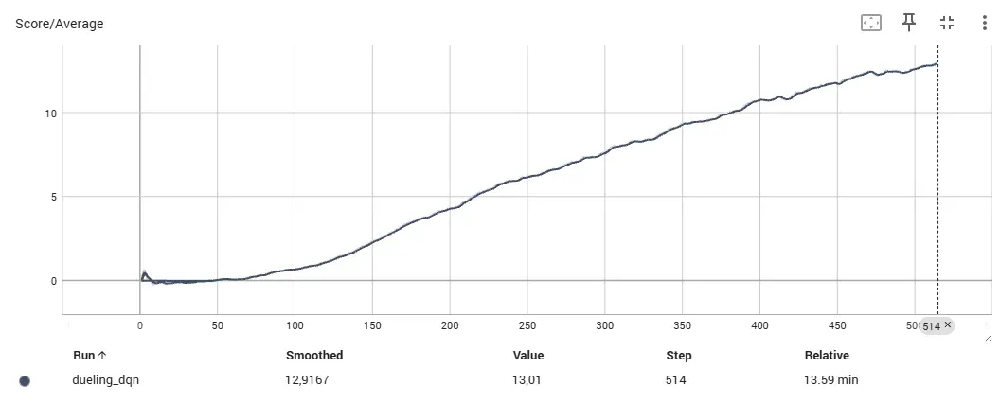
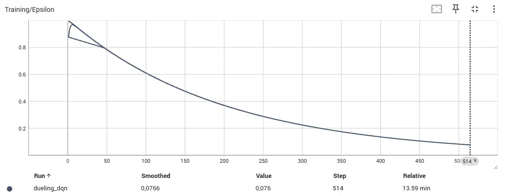

# Navigation - Banana Collector

Train an agent using Deep Q-Network (Double DQN and Dueling DQN) to collect yellow bananas while avoiding blue bananas in a Unity ML-Agents environment.

**Trained on NVIDIA GeForce RTX 5080 - both variants completed in ~15 minutes!**

## Project Overview

This project implements a Double DQN agent that learns to navigate a square world and collect yellow bananas (+1 reward) while avoiding blue bananas (-1 reward).

**Environment:**
- State space: 37 dimensions (velocity + ray-based perception)
- Action space: 4 discrete actions (forward, backward, left, right)
- Goal: Average score >= 13.0 over 100 consecutive episodes

**Implementations:**
- Double DQN: Solved in 449 episodes
- Dueling DQN: Solved in 414 episodes (about 8% faster)
- Both way faster than expected baseline (~1800 episodes)

**Hardware:**
- NVIDIA GeForce RTX 5080 16GB
- Training time: ~15 minutes per run
- TensorBoard logging enabled

## Environment Setup

### Prerequisites
- Python 3.9
- Anaconda or Miniconda
- NVIDIA GPU with CUDA support (tested on RTX 5080)
- Windows, macOS, or Linux

### Installation

1. Create and activate conda environment:
```bash
conda create --name drlnd python=3.9 -y
conda activate drlnd
```

2. Install PyTorch with CUDA support:
```bash
conda install pytorch torchvision torchaudio pytorch-cuda=11.8 -c pytorch -c nvidia -y
```

3. Install dependencies:
```bash
pip install -r requirements.txt
```

4. Download Unity Environment:
   - [Windows (64-bit)](https://s3-us-west-1.amazonaws.com/udacity-drlnd/P1/Banana/Banana_Windows_x86_64.zip)
   - [Mac OSX](https://s3-us-west-1.amazonaws.com/udacity-drlnd/P1/Banana/Banana.app.zip)
   - [Linux](https://s3-us-west-1.amazonaws.com/udacity-drlnd/P1/Banana/Banana_Linux.zip)

5. Extract the environment to the project directory:
```
p1_navigation/
├── Banana_Windows_x86_64/
│   └── Banana.exe
├── model.py
├── dqn_agent.py
├── Navigation.ipynb
└── ...
```

## Training the Agent

1. Start Jupyter Notebook:
```bash
jupyter notebook
```

2. Open `Navigation.ipynb`

3. Run cells sequentially:
   - Import packages
   - Initialize environment
   - Initialize agent
   - Define training function
   - Start training with `scores = dqn()`

Training takes approximately 20-60 minutes depending on hardware.

**Note on RTX 5080:** PyTorch may show a warning about sm_120 compatibility, but training works perfectly and achieves excellent results.

## Files

- `model.py` - Neural network architecture (supports both standard and Dueling DQN)
- `dqn_agent.py` - DQN agent implementation with Double DQN
- `Navigation.ipynb` - Training notebook with TensorBoard support
- `checkpoint_double_dqn.pth` - Trained weights for Double DQN (449 episodes)
- `checkpoint_dueling_dqn.pth` - Trained weights for Dueling DQN (414 episodes)
- `requirements.txt` - Python dependencies
- `runs/` - TensorBoard logs

## Algorithm

Two implementations were tested:

### Double DQN
- Experience Replay (buffer size: 100,000)
- Target Network (soft updates with tau=0.001)
- Epsilon-greedy exploration (decay from 1.0 to 0.01)
- Neural Network: 37 → 64 → 64 → 4
- Learning rate: 0.0005
- Batch size: 64
- Discount factor (gamma): 0.99

### Dueling DQN
Same hyperparameters as Double DQN, but with dueling architecture:
- Splits final layer into Value stream (64 → 1) and Advantage stream (64 → 4)
- Combines them using: Q(s,a) = V(s) + (A(s,a) - mean(A(s,a)))
- This helps the network learn which states are valuable independent of actions

Both implementations use Double DQN (action selection from local network, evaluation from target network).

## Results

### Double DQN Training
```
Episode 100:   0.73
Episode 200:   4.89
Episode 300:   7.60
Episode 400:  10.57
Episode 500:  12.76
Episode 549:  13.00 (Solved in 449 episodes)
```

### Dueling DQN Training
```
Episode 100:   0.65
Episode 200:   4.30
Episode 300:   7.62
Episode 400:  10.81
Episode 500:  12.63
Episode 514:  13.01 (Solved in 414 episodes)
```

### Comparison

Dueling DQN was about 35 episodes faster than Double DQN. Both learned pretty much at the same pace in the beginning, but Dueling reached the goal slightly faster. The performance difference isn't huge, which makes sense since both use the same core Double DQN algorithm - Dueling just adds the value/advantage split.

Overall both implementations crushed the baseline. The RTX 5080 made training super fast.

### Training Plots

**Double DQN - Complete Training Curve:**


Training progression for Double DQN. Solved in 449 episodes with clear learning curve.

**Dueling DQN - Complete Training Curve:**


Training progression for Dueling DQN. Solved in 414 episodes, slightly faster convergence.

**TensorBoard Monitoring (Dueling DQN):**



Average score smoothly increases from 0 to 13+ over 514 episodes.


Individual episode scores with variance. The smoothed line shows clear upward trend.



Exploration rate (epsilon) decreases from 1.0 to ~0.08 as the agent becomes more confident.

## Testing the Trained Agent

Load saved weights and watch the agent:
```python
# Load Double DQN weights (449 episodes)
agent.qnetwork_local.load_state_dict(torch.load('checkpoint_double_dqn.pth'))

# OR load Dueling DQN weights (414 episodes)
agent.qnetwork_local.load_state_dict(torch.load('checkpoint_dueling_dqn.pth'))

# Run test episode
env_info = env.reset(train_mode=False)[brain_name]
state = env_info.vector_observations[0]
score = 0

for _ in range(300):
    action = agent.act(state)
    env_info = env.step({brain_name: [action]})[brain_name]
    state = env_info.vector_observations[0]
    reward = env_info.rewards[0]
    done = env_info.local_done[0]
    score += reward
    if done:
        break

print('Score:', score)
```

## Future Improvements

Potential enhancements:
- Prioritized Experience Replay
- Noisy Networks for exploration
- Multi-step learning (n-step returns)
- Distributional RL (C51, QR-DQN)
- Rainbow DQN (combination of all improvements)
- Hyperparameter tuning
- Learning from pixels (visual input)

## License

This project is part of the Udacity Deep Reinforcement Learning Nanodegree.