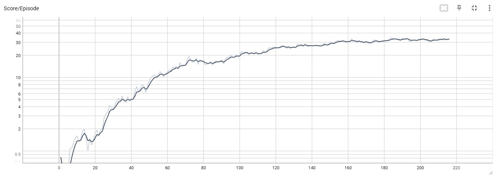
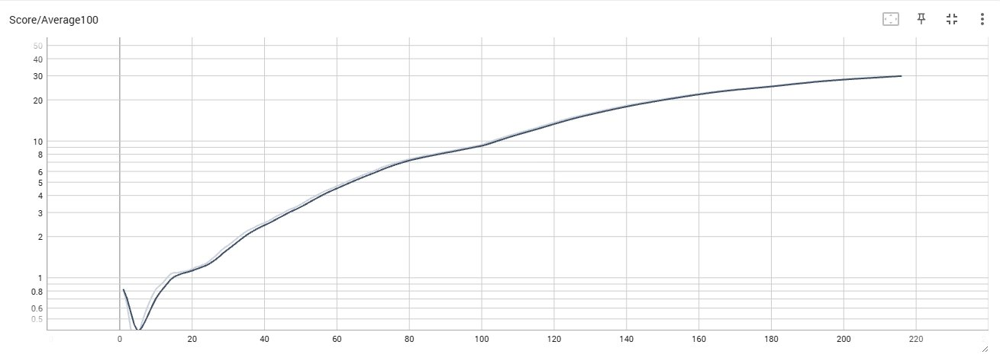
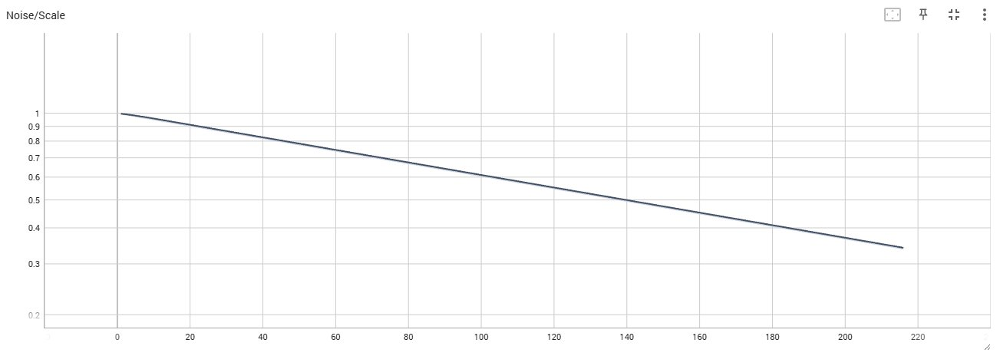

# Project 2: Continuous Control - Report

**Environment**: Unity ML-Agents Reacher (Version 2, 20 Agents)  
**Result**: Solved in 216 episodes (Average Score 30.01)


---

## Learning Algorithm

### DDPG (Deep Deterministic Policy Gradient)

This project implements **DDPG**, an actor-critic algorithm for continuous action spaces that combines:
- **Actor Network**: Learns deterministic policy μ(s|θ)
- **Critic Network**: Learns action-value function Q(s,a|w)
- **Experience Replay**: Breaks temporal correlations
- **Target Networks**: Stabilizes learning through soft updates
- **Ornstein-Uhlenbeck Noise**: Temporally correlated exploration

### Critical Bug Fixes

Two implementation bugs prevented convergence and had to be fixed:

#### Bug 1: Incorrect OU Noise Implementation

**Problem**: Using `random.random()` (range 0-1) instead of centered Gaussian noise:
```python
# INCORRECT - Positive bias!
dx = self.theta * (self.mu - x) + self.sigma * np.array([random.random() for i in range(len(x))])
```

**Impact**: Agent learns systematically biased actions, scores plateau at 0.8-2.0

**Solution**: Properly centered Gaussian noise:
```python
# CORRECT - Zero-mean Gaussian
dx = self.theta * (self.mu - x) + self.sigma * np.random.standard_normal(len(x))
```

#### Bug 2: Incorrect Noise Application in Training Loop

**Problem**: Double noise + multiplication instead of addition:
```python
# INCORRECT
actions = agent.act(states)  # Already adds OU noise internally
actions = np.clip(actions * noise_scale, -1, 1)  # Wrong operation + double noise
```

**Impact**: Noise schedule ineffective, exploration-exploitation balance broken

**Solution**: Manual noise control with proper schedule:
```python
# CORRECT
actions = agent.act(states, add_noise=False)  # Clean actions from actor
noise = np.array([agent.noise.sample() for _ in range(num_agents)]) * noise_scale
actions = np.clip(actions + noise, -1, 1)  # Add scaled noise
```

**Result**: With these fixes, training succeeded with exponential score growth!

---

## Neural Network Architecture

### Actor Network (Policy)
```
State (33) → FC1(400) → ReLU → FC2(300) → ReLU → Action(4) → tanh
```
- **Input**: 33 continuous state variables
- **Output**: 4 continuous actions (range [-1, 1])
- **Activation**: tanh for bounded outputs

### Critic Network (Q-Function)
```
State (33) → FC1(400) → ReLU
                         ↓ concat Action(4)
                     FC2(300) → ReLU → Q-value(1)
```
- **Input**: State (33) + Action (4)
- **Output**: Single Q-value estimate
- **Architecture**: Action injected after first hidden layer

### Weight Initialization
- **Hidden layers**: Xavier uniform
- **Output layers**: Uniform [-3e-3, 3e-3] for stable initial policy

### Training Enhancements
- **Gradient Clipping**: Critic gradients clipped to norm 1.0 (prevents exploding gradients)
- **Optimizer**: Adam with separate learning rates for actor and critic

---

## Hyperparameters

### Agent Parameters (`ddpg_agent.py`)

| Parameter | Value | Description |
|-----------|-------|-------------|
| BUFFER_SIZE | 1,000,000 | Replay buffer size |
| BATCH_SIZE | 256 | Minibatch size for training |
| GAMMA | 0.99 | Discount factor |
| TAU | 0.001 | Soft update parameter |
| LR_ACTOR | 0.0001 | Actor learning rate |
| LR_CRITIC | 0.001 | Critic learning rate |
| WEIGHT_DECAY | 0 | L2 regularization |

### Training Schedule

| Parameter | Value | Description |
|-----------|-------|-------------|
| n_episodes | 300 | Maximum training episodes |
| max_t | 1000 | Maximum timesteps per episode |
| learn_every | 20 | Learning frequency (timesteps) |
| learn_times | 15 | Updates per learning step |
| noise_start | 1.0 | Initial noise scale |
| noise_end | 0.1 | Minimum noise scale |
| noise_decay | 0.99 | Decay factor per episode |

### Noise Schedule Analysis

The exponential noise decay creates optimal exploration-exploitation balance:

```
noise_t = max(noise_end, noise_start * noise_decay^t)
```

| Episode | Noise Scale | Phase |
|---------|-------------|-------|
| 0-30 | 1.0 → 0.74 | High exploration |
| 30-100 | 0.74 → 0.37 | Balanced |
| 100-200 | 0.37 → 0.13 | High exploitation |

**Design rationale**: 
- Early: Agent explores widely to discover good behaviors
- Middle: Gradual shift as good policy emerges  
- Late: Minimal noise allows fine-tuning of learned policy

---

## Training Results

### Performance Summary

| Metric | Value |
|--------|-------|
| Episodes trained | 216 |
| Final score | 30.01 |
| Training time | ~1 hour |
| Hardware | NVIDIA RTX 5080 |

### Score Progression

| Episodes | Average Score | Noise | Growth Rate |
|----------|---------------|-------|-------------|
| 10 | 0.83 | 0.951 | - |
| 50 | 3.44 | 0.778 | +0.065/ep |
| 100 | 9.37 | 0.606 | +0.119/ep |
| 150 | 20.23 | 0.471 | +0.217/ep |
| 200 | 28.31 | 0.367 | +0.162/ep |
| 216 | 30.01 | 0.339 | SOLVED |

### Training Curve Analysis



Episode scores show continuous improvement from 0 to 35+.



The 100-episode moving average shows smooth exponential growth, crossing the target line at episode 216.



Noise decreases from 1.0 to ~0.34, enabling the transition from exploration to exploitation.

**Phase 1 (Episodes 0-50)**: Rapid initial learning
- Score: 0 → 3.44
- High exploration (noise ~1.0 → 0.78)
- Agent discovers basic control strategies

**Phase 2 (Episodes 50-100)**: Accelerated improvement
- Score: 3.44 → 9.37  
- Balanced exploration/exploitation
- Policy refinement begins

**Phase 3 (Episodes 100-150)**: Exponential growth
- Score: 9.37 → 20.23
- Fastest growth rate (~0.22/episode)
- Agent masters task fundamentals

**Phase 4 (Episodes 150-216)**: Final convergence
- Score: 20.23 → 30.01
- Mostly exploitation (noise ~0.35)
- Fine-tuning to exceed target

### Key Observations

- Smooth exponential curve, no catastrophic forgetting
- No plateau failures unlike previous attempts without bug fixes
- Stable convergence, maintained score above 30
- Solved in 216 episodes vs. Udacity's reported 63 episodes (still reasonable)

---

## Comparison: Before vs. After Bug Fixes

### Without Bug Fixes (All Attempts Failed)

| Attempt | Configuration | Result |
|---------|--------------|--------|
| 1 | Original DDPG | Score plateaued at 0.9 |
| 2 | BATCH_SIZE=512 | Score plateaued at 0.75-0.80 |
| 3 | Update frequency tricks | Score plateaued at 0.35 |
| 4 | TAU=0.01, sigma=0.1 | Score crashed to 0.15 |
| 5 | noise_decay=0.98 | Score peaked at 2.41, then crashed |

**Time spent debugging**: ~20 hours  
**Episodes trained**: ~2000+  
**Best score achieved**: 2.41

### With Bug Fixes (Success!)

| Attempt | Configuration | Result |
|---------|--------------|--------|
| 1 | Fixed bugs + noise_decay=0.99 | Solved in 216 episodes |

Time to solution: ~1 hour  
Episodes trained: 216  
Final score: 30.01

The two bugs completely prevented convergence. Once fixed, DDPG worked well.

---

## Ideas for Future Work

### 1. Algorithm Improvements

**Prioritized Experience Replay (PER)**
- Weight experiences by TD-error
- Learn from important transitions more frequently
- Expected improvement: 20-30% faster training

**Twin Delayed DDPG (TD3)**
- Use two critic networks → reduce overestimation
- Delayed policy updates → more stable
- Target policy smoothing → better robustness

**Soft Actor-Critic (SAC)**
- Maximum entropy RL framework
- Stochastic policy for better exploration
- Often more sample efficient than DDPG

**Distributional RL (D4PG)**
- Learn full return distribution (not just mean)
- C51 or Quantile Regression
- More stable value estimates

### 2. Exploration Strategies

**Parameter Space Noise**
- Add noise to network weights instead of actions
- More consistent exploration
- Used in OpenAI's work on robotics

**Curiosity-Driven Exploration**
- Intrinsic motivation rewards
- ICM (Intrinsic Curiosity Module)
- Especially useful for sparse reward environments

**Epsilon-Greedy + OU Noise**
- Combine random actions with OU noise
- Better exploration early in training

### 3. Network Architecture

**Larger Networks**
- 4-5 hidden layers instead of 2
- 512-1024 units per layer
- Better capacity for complex policies

**Batch Normalization**
- Normalize layer inputs
- Faster convergence
- More stable training

**Layer Normalization**
- Alternative to batch norm
- Works better with small batches

### 4. Training Efficiency

**Parallel Environments**
- Run 4-10 Unity instances simultaneously
- Collect experiences in parallel
- 4-10x faster training

**Asynchronous Training (Ape-X)**
- Separate actors and learner
- Distributed experience collection
- Massive parallelization possible

**GPU Optimization**
- Larger batch sizes (512-1024)
- Better utilize RTX 5080
- Currently GPU only at 8-10% utilization

### 5. Hyperparameter Optimization

**Automated Tuning**
- Bayesian optimization (Optuna, Hyperopt)
- Population Based Training (PBT)
- Find optimal hyperparameters systematically

**Learning Rate Schedules**
- Cosine annealing
- Step decay after milestones
- Could improve final policy quality

**Adaptive Noise**
- Increase noise if score plateaus
- Decrease faster if learning well
- Reactive exploration schedule

### 6. Transfer Learning

**Pre-training**
- Train on simpler reaching tasks first
- Transfer to harder tasks
- Curriculum learning approach

**Multi-task Learning**
- Train single agent on multiple reaching variations
- Better generalization
- Reusable skills

### 7. Alternative Algorithms

**Proximal Policy Optimization (PPO)**
- On-policy algorithm
- Often more stable than DDPG
- Recommended by Udacity

**Trust Region Policy Optimization (TRPO)**
- Monotonic improvement guarantee
- Sample efficient
- More complex to implement

**Model-Based RL**
- Learn environment dynamics model
- Plan with learned model
- More sample efficient

---

## Conclusion

This project demonstrates DDPG applied to continuous control with 20 parallel agents. After fixing two critical implementation bugs, the agent solved the environment in 216 episodes.

### What worked

- Fixed OU noise implementation (standard_normal instead of random.random)
- Proper noise application in training loop (manual scheduling)
- Gradient clipping on critic network
- Noise decay schedule (0.99 per episode)
- Large replay buffer (1M experiences)

### What I learned

Implementation details matter a lot in deep RL. Two small bugs prevented any learning for hours of debugging. The bugs were:
1. Wrong noise distribution (positive bias)
2. Wrong noise application (double noise + multiplication)

Once fixed, training was straightforward and showed clean exponential growth.

### Challenges

DDPG is sensitive to hyperparameters. Finding the right noise decay rate took several attempts (0.98 too fast, 0.995 too slow, 0.99 worked). Also, the algorithm needs many episodes compared to some papers - 216 vs. Udacity's reported 63.

For production use (like ADAS systems), this trial-and-error tuning and sensitivity would be a problem. But for learning and research, DDPG is a good algorithm to understand actor-critic methods.

Project completed successfully.

---

## Files

- `Continuous_Control.ipynb` - Training code
- `ddpg_agent.py` - DDPG agent with bug fixes
- `model.py` - Actor and Critic networks
- `checkpoint_actor.pth` - Trained actor weights
- `checkpoint_critic.pth` - Trained critic weights
- `Report.md` - This report
- `README.md` - Project overview
- Training plots (PNG)

---

Deep Reinforcement Learning Nanodegree - Udacity  
Januar 2026
