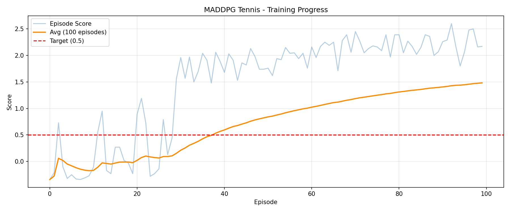

[//]: # (Image References)

[image1]: https://user-images.githubusercontent.com/10624937/42135623-e770e354-7d12-11e8-998d-29fc74429ca2.gif "Trained Agent"
[image2]: https://user-images.githubusercontent.com/10624937/42135622-e55fb586-7d12-11e8-8a54-3c31da15a90a.gif "Soccer"


# Project 3: Collaboration and Competition

### Introduction

For this project, you will work with the [Tennis](https://github.com/Unity-Technologies/ml-agents/blob/master/docs/Learning-Environment-Examples.md#tennis) environment.

![Trained Agent][image1]

In this environment, two agents control rackets to bounce a ball over a net. If an agent hits the ball over the net, it receives a reward of +0.1. If an agent lets a ball hit the ground or hits the ball out of bounds, it receives a reward of -0.01. The goal of each agent is to keep the ball in play.

The observation space consists of 8 variables corresponding to the position and velocity of the ball and racket. Each agent receives its own, local observation. Two continuous actions are available: movement toward (or away from) the net, and jumping.

The task is episodic. To solve the environment, the agents must get an average score of +0.5 over 100 consecutive episodes (taking the maximum score over both agents each episode).

### Result

The environment was solved in **100 episodes** with an average score of **1.48** — well above the required 0.5.



### Getting Started

1. Download the environment for your operating system:
    - Linux: [click here](https://s3-us-west-1.amazonaws.com/udacity-drlnd/P3/Tennis/Tennis_Linux.zip)
    - Mac OSX: [click here](https://s3-us-west-1.amazonaws.com/udacity-drlnd/P3/Tennis/Tennis.app.zip)
    - Windows (32-bit): [click here](https://s3-us-west-1.amazonaws.com/udacity-drlnd/P3/Tennis/Tennis_Windows_x86.zip)
    - Windows (64-bit): [click here](https://s3-us-west-1.amazonaws.com/udacity-drlnd/P3/Tennis/Tennis_Windows_x86_64.zip)

2. Place the file in the `p3_collab-compet/` folder and unzip it.

3. Set up the Python environment:

```bash
conda create -n drlnd python=3.8
conda activate drlnd
pip install unityagents==0.4.0
pip install torch torchvision --index-url https://download.pytorch.org/whl/cu121
pip install matplotlib tensorboard numpy jupyter
```

### Instructions

Open `Tennis.ipynb` and run all cells to train the agent. TensorBoard logs are saved to `runs/` and can be viewed with:

```bash
tensorboard --logdir=runs --port=6006
```

### Files

- `Tennis.ipynb` - training notebook
- `ddpg_agent.py` - MADDPG agent implementation
- `model.py` - Actor and Critic networks
- `checkpoint_actor.pth` - trained actor weights
- `checkpoint_critic_0.pth` - trained critic weights agent 0
- `checkpoint_critic_1.pth` - trained critic weights agent 1
- `Report.md` - project report

### (Optional) Challenge: Soccer Environment

After completing the project, you might like to try the more difficult **Soccer** environment.

![Soccer][image2]

You need only select the environment that matches your operating system:
- Linux: [click here](https://s3-us-west-1.amazonaws.com/udacity-drlnd/P3/Soccer/Soccer_Linux.zip)
- Mac OSX: [click here](https://s3-us-west-1.amazonaws.com/udacity-drlnd/P3/Soccer/Soccer.app.zip)
- Windows (32-bit): [click here](https://s3-us-west-1.amazonaws.com/udacity-drlnd/P3/Soccer/Soccer_Windows_x86.zip)
- Windows (64-bit): [click here](https://s3-us-west-1.amazonaws.com/udacity-drlnd/P3/Soccer/Soccer_Windows_x86_64.zip)

Note: do not submit a project with the Soccer environment.
