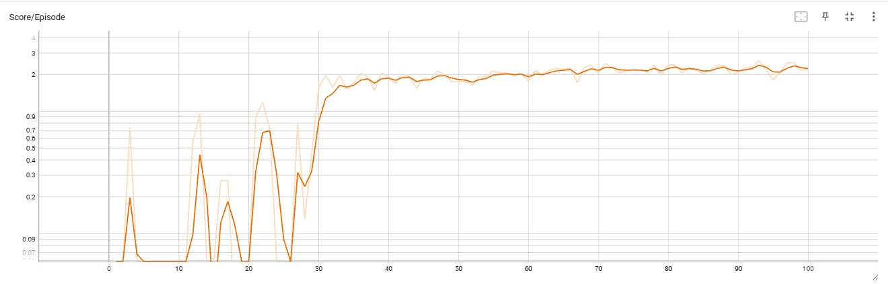
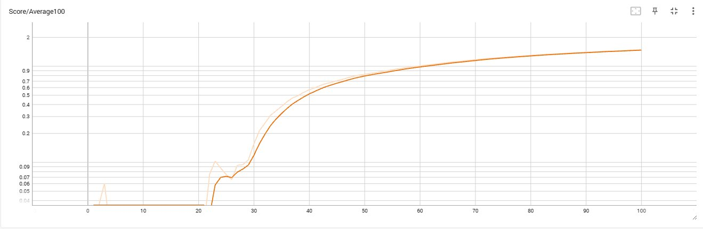
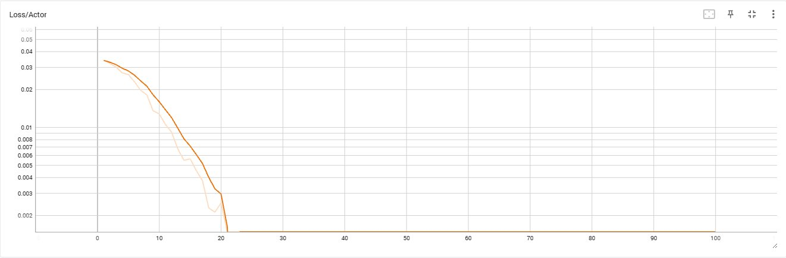
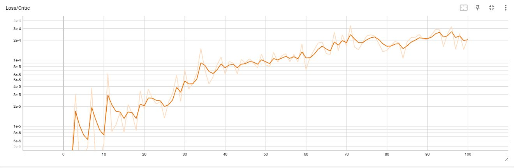

# Project 3: Collaboration and Competition - Report

**Environment**: Unity ML-Agents Tennis (2 Agents)  
**Result**: Solved in 100 episodes (Average Score 1.48)


---

## Learning Algorithm

### MADDPG (Multi-Agent Deep Deterministic Policy Gradient)

This project implements **MADDPG**, which extends DDPG from Project 2 to the multi-agent setting. The core idea is **centralized training with decentralized execution**:

- During **training**: each agent's Critic sees ALL agents' states and actions (48 + 4 dimensions)
- During **execution**: each agent's Actor sees only its own local observation (24 dimensions)

This solves the non-stationarity problem: from Agent 0's perspective, Agent 1 is also learning simultaneously, which would otherwise violate the stationarity assumption of standard single-agent RL.

### Key Design Decisions

#### 1. Shared Actor (Udacity recommendation)
Udacity's hint: *"each agent used the same actor network to select actions"*

Both agents share one Actor network instead of two separate ones. This doubles the number of training examples per update and speeds up convergence significantly. Tennis is a symmetric environment — both sides of the net are identical — so one policy works for both agents (self-play).

#### 2. Separate Critics per Agent (centralized)
Each agent has its own Critic, but it receives the concatenated observations and actions of both agents:
```
Critic input: [obs_agent0 (24) + obs_agent1 (24) + action_agent0 (2) + action_agent1 (2)] = 52 dim
Critic output: Q-value (1)
```

#### 3. Shared Replay Buffer (Udacity recommendation)
Udacity's hint: *"experience was added to a shared replay buffer"*

Both agents' experiences are stored in one common buffer.

#### 4. Experience Mirroring
Tennis is symmetric — Agent 0 and Agent 1 play identical roles on opposite sides of the net. Every collected experience can be flipped (swap Agent 0 and Agent 1) to produce equally valid training data at zero extra cost. This doubles the effective buffer size without any additional simulation steps.

---

## Neural Network Architecture

### Actor Network (shared by both agents)
```
Input (24) → FC1(256) → BatchNorm → ReLU → FC2(128) → ReLU → Output(2) → tanh
```
- **Input**: 24 continuous state variables (local observation)
- **Output**: 2 continuous actions in range [-1, 1]
- **BatchNorm**: stabilizes training across agents

### Critic Network (separate per agent, centralized)
```
Input_states (48) → FC1(256) → BatchNorm → ReLU
                                              ↓ concat Actions (4)
                                          FC2(260) → ReLU → Q-value (1)
```
- **Input**: all agents' states (48) + all agents' actions (4) injected after first layer
- **Output**: single Q-value estimate

### Weight Initialization
- Hidden layers: Xavier uniform (`hidden_init`)
- Output layers: Uniform [-3e-3, 3e-3] for stable initial policy

---

## Hyperparameters

| Parameter | Value | Description |
|-----------|-------|-------------|
| BUFFER_SIZE | 1,000,000 | Replay buffer size |
| BATCH_SIZE | 256 | Minibatch size |
| GAMMA | 0.99 | Discount factor |
| TAU | 0.001 | Soft update parameter |
| LR_ACTOR | 0.0001 | Actor learning rate |
| LR_CRITIC | 0.001 | Critic learning rate |
| WEIGHT_DECAY | 0 | L2 regularization |
| fc1_units | 256 | First hidden layer size |
| fc2_units | 128 | Second hidden layer size |

---

## Training Results

| Metric | Value |
|--------|-------|
| Episodes to solve | 100 |
| Final average score | 1.48 |
| Target score | 0.5 |
| Training time | ~34 minutes |
| Hardware | NVIDIA RTX 5080 |

Udacity's own solution reached a best average score of 0.9148. This implementation reached **1.48**, nearly 3x the required target.

### Score Progression



Episodes 0-20: high exploration, score still near zero. Episodes 20-30: agent discovers how to hit the ball, rapid growth. Episodes 30+: stable above 0.5, continuing to improve toward ~2.0.



Clean exponential growth crossing the 0.5 target around episode 37, reaching 1.48 at episode 100.

### Loss Curves



Actor loss decreases smoothly toward zero — the shared actor converges to a stable policy.



Critic loss increases slightly over time, which is expected and healthy: as the policy improves, the agent achieves longer rallies, making Q-value estimation more complex.

---

## Ideas for Future Work

**Prioritized Experience Replay (PER)**  
Weight experiences by TD-error so more informative transitions are sampled more often. Could improve sample efficiency further.

**Twin Delayed DDPG (TD3)**  
Use two critic networks to reduce Q-value overestimation, with delayed policy updates for more stable training.

**Soft Actor-Critic (SAC)**  
Maximum entropy RL framework with stochastic policy. Often more robust than DDPG-based methods and less sensitive to hyperparameters.

**Proper num_workers parallelization**  
Unity ML-Agents v0.4 does not support multiple parallel environments reliably. Upgrading to a newer version of ML-Agents would allow proper parallel experience collection and faster training.

**Curriculum Learning**  
Start with easier subtasks (e.g. just keeping the ball in the air) before the full cooperative task. Could accelerate initial learning.

---

## Files

- `Tennis.ipynb` - training notebook with full training loop and TensorBoard logging
- `ddpg_agent.py` - MADDPG implementation (shared actor, separate critics, experience mirroring)
- `model.py` - Actor and Critic PyTorch networks with BatchNorm
- `checkpoint_actor.pth` - trained actor weights
- `checkpoint_critic_0.pth` - trained critic weights agent 0
- `checkpoint_critic_1.pth` - trained critic weights agent 1
- `training_plot.png` - score plot (matplotlib)
- `tb_score_episode.png` - TensorBoard: score per episode
- `tb_score_avg.png` - TensorBoard: moving average score
- `tb_loss_actor.png` - TensorBoard: actor loss
- `tb_loss_critic.png` - TensorBoard: critic loss

---

Deep Reinforcement Learning Nanodegree - Udacity  
March 2026
